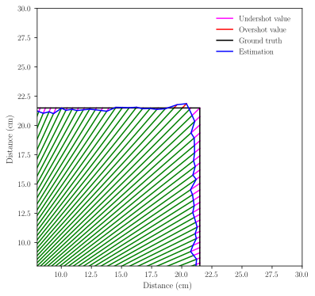

# arduino-mapping

This repository contains code written to test the capabilities of environment mapping within a robotic system. The task at hand is exploring the challenge of obstacle characterisation. A baseline solution is produced with the use of an infrared (IR) proximity sensor. Subsequently, an optimised solution using two proximity sensors is produced. The goal is to understand how the optimisation influences the task of mapping. 

It also includes a report detailing the design of the experiment, implementations and evaluation of performance between the baseline and optimised solutions.

The experiment and its implementations have been carried out on a Pololu Romi 32U4 with a Sharp GP2Y0A60SZLF IR proximity sensor.

## Team

[Tim Nguyen](https://github.com/nt1m), [Andrei Nitu](https://github.com/AndreiCNitu), [Ainsley Rutterford](https://github.com/ainsleyrutterford) and [Faizaan Sakib](https://github.com/fznsakib)

Produced as part of the *Robotics Systems* unit at the University of Bristol.

## Hypothesis

> Infrared proximity sensors perform with a varying degree of accuracy, determined by the distance being measured. They are prone to a higher degree of error at the limits of their operation. External factors based on the environment and the system itself can introduce additional error. We hypothesise that with the introduction of a second sensor positioned appropriately, smaller distances can be reliably measured where previously not possible due to an increased combined range of distance covered. Furthermore, a combination of two sensor readings will help to produce better estimations.

## Experiment

1. The robot is placed in the centre of a square perimeter acting as a wall obstacle, with sides of length n cm
2. Starting from the direction it is facing, the robot is switched on and rotates a full circle in a clockwise direction.
3. During the rotation, distance measurements from the proximity sensor are taken for the angle it is facing.
4. The resulting output is an array of distances with the index of each value corresponding to the angle it was
measured at.
 
Independent variables:
  - Number of proximity sensors used (1 and 2)
  - Size of square perimeter
  
Dependent variable:
  - Distance measurements obtained
  

  

A bird’s-eye view of the experiment.

## Results

The main qualitative metric used to assess the performance of the subsystem was plotting the estimated coordinate values produced by the robot, overlaid with the ground truth coordinates that represent the perimeter. These plots allowed us to visually inspect the results and make inferences about the performance that would otherwise have been hard to make.

  

The results highlighted the improvement from using two IR sensors for square perimeters of length 33cm and 66cm. The second sensor was able to accurately measure the small distances, which were previously over-estimated. Finally, the performance for the larger perimeter, although not perfect, was significantly better using two proximity sensors.

  

